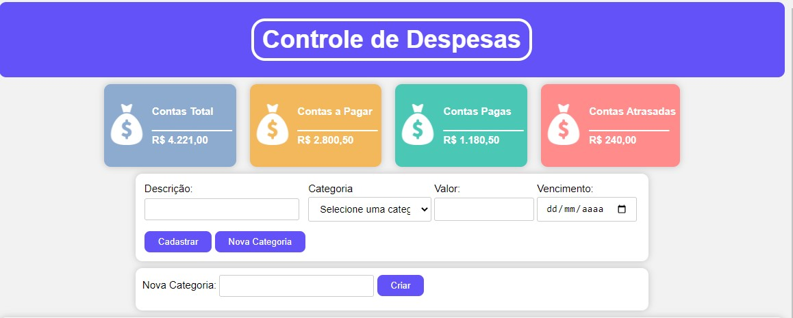

# Meu Front

Este pequeno projeto faz parte do projeto de um aplicativo de **XXXXX** desenvolvido como trabalho final "XXXX" da Sprint 01 do curso de pós graduação da PUC Rio.

O objetivo aqui é criar um front end que permita acessar as APIs desenvolvidas no backend.

https://financetati.onrender.com/

# Principais Funcionalidades

 1) cadastro de despesas por nome, data de vencimento, categoria e valor;

 2) Opção para incluir novas categorias;

 3) listagem de todas as despesas cadastradas; 

 4) Aplicação destaca em status de pagamento das despesas: , , ;

 5) Botões para EDITAR, PAGAR/NÃO PAGAR e EXCLUIR uma despesa: ; 

 6) A aplicação também indica os totais de contas cadastradas, a pagar, contas pagas e atrasadas pagas. 

# Preview

# Como executar

Basta fazer o download do projeto e abrir o arquivo index.html no seu browser.

última atualização 27/04/23